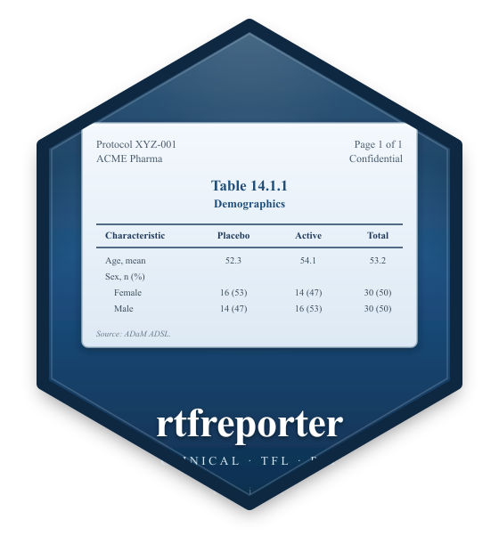

<!-- README.md is generated by hand; keep it short and link to the pkgdown site. -->

# rtfreporter 

<!-- badges: start -->
[](https://github.com/ichirio/rtfreporter/actions/workflows/R-CMD-check.yaml)
[](https://github.com/ichirio/rtfreporter/actions/workflows/test-coverage.yaml)
[](https://app.codecov.io/gh/ichirio/rtfreporter)
[](https://github.com/ichirio/rtfreporter/actions/workflows/pkgdown.yaml)
[](https://lifecycle.r-lib.org/articles/stages.html#experimental)
[](https://opensource.org/licenses/MIT)
<!-- badges: end -->

`rtfreporter` is an R toolkit for generating **Rich Text Format (RTF)
Tables, Listings and Figures (TFLs)** for clinical trial deliverables —
in **exactly one report style**: the conventional clinical layout
with a borderless header table, a centred title block, a clinical-TFL
body table (column-header top + bottom rules, no body borders), and a
left-aligned footnote.  The package logo above is literally the kind
of page `generate_rtfreport()` produces.

## Why rtfreporter?

We **deliberately keep the scope small**.  rtfreporter is not a
general-purpose RTF library; it is a focused tool for the one clinical
TFL style we want to ship.  That scope cap is the point — it keeps the
package small enough to read end-to-end, thorough to test, and realistic
to maintain.  If the supported layout matches your team's house style,
you get publication-ready deliverables with almost no configuration.

## Installation

The package is not on CRAN yet. Install the development version from GitHub:

``` r
# install.packages("remotes")
remotes::install_github("ichirio/rtfreporter")
```

## A 30-second example

``` r
library(rtfreporter)
library(magrittr)

df <- data.frame(
  USUBJID = c("001-001", "001-002", "001-003"),
  TRT     = c("Placebo", "Active",  "Active"),
  AVAL    = c(12.3, 14.1, 11.7)
)

doc <- rtf_document() %>%
  rtf_section(
    page    = 1,
    secinfo = list(
      header = rtf_header(rows = list(
        c(l = "Protocol XYZ-001", r = "Confidential"),
        c(l = "Table 14.1.1",     r = "Page {AUTO_PAGE} of {AUTO_TOTAL_PAGES}")
      )),
      footer = rtf_footer(c(c = "ACME Pharma, Inc."))
    )
  ) %>%
  rtf_tables(
    list(df),
    border           = "tfl",
    row_height_twips = 280L,
    titles    = list(c("Subject Summary", "Safety Population")),
    footnotes = list(c("Source: ADaM ADSL"))
  )

generate_rtfreport(doc, "T_14_1_1.rtf", overwrite = TRUE)
```

<p align="center">
  
</p>

<p align="center"><sub><em>The generated <code>T_14_1_1.rtf</code>, opened in a word processor.</em></sub></p>

## A focused tool, on purpose

What the small scope buys you:

- **One output style, opinionated defaults.**  No theme zoo, no
  "render anything" pipeline.  The defaults match the conventional
  clinical TFL look out of the box; you do not have to assemble it.
- **Only the features TFL → RTF needs.**  Multi-section headers /
  footers, spanning column headers, automatic page-number fields
  (`{AUTO_PAGE}` / `{AUTO_TOTAL_PAGES}`), embedded figures, and
  per-document concatenation via `assemble_rtf()`.  If a feature
  would not appear on a real clinical TFL, we resist adding it.
- **Maintainability over breadth.**  Saying *no* to scope creep is
  what keeps the package small, the tests fast, and the API stable
  enough to bring through to CRAN.
- **Composable pipe API.**  `rtf_document() |> rtf_section() |>
  rtf_tables() |> generate_rtfreport()` — the same vocabulary every
  time, so building a 50-TFL deliverable is a loop.

If your deliverables need a substantially different layout, another tool
may serve you better — and that trade-off is intentional.  We would
rather do one well-defined style really well than do everything passably.
You are warmly welcome to use rtfreporter for the styles it supports.

## Bring your own table tool

The clinical-table ecosystem has several excellent builders —
[tfrmt](https://gsk-biostatistics.github.io/tfrmt/),
[gtsummary](https://www.danieldsjoberg.com/gtsummary/),
[rtables](https://insightsengineering.github.io/rtables/) /
[tern](https://insightsengineering.github.io/tern/), and
[gt](https://gt.rstudio.com) — and, honestly, no single de-facto
standard has emerged yet.  rtfreporter does not ask you to pick one, to
switch, or to re-state your table in yet another vocabulary.  Whatever
your team already uses to compute and format the numbers,
[`as_rtftables()`](https://ichirio.github.io/rtfreporter/reference/as_rtftables.html)
reads that object — its column labels, alignment, spanning headers,
titles, footnotes and per-cell styling — and carries the metadata through
to RTF.

And even if you use a tool we do **not** read directly, you are still
covered: convert its result to a plain `data.frame` / tibble and
rtfreporter lays it out just the same.  A bare data.frame carries no
display metadata, so you simply re-specify what you want — column headers,
alignment, and so on — on `rtf_tables()` / `rtftable()` yourself.

Worked, tool-by-tool examples will be added as articles over time.

## Why RTF?

RTF is an old format, and we are perfectly aware of that.  Producing
`.docx` directly, or rendering straight to PDF, is entirely possible and
in some respects more modern.  We chose RTF on purpose, for the most
old-fashioned of reasons: **it is the simplest thing that fully meets the
need.**

For clinical deliverables the workflow we care about is
**RTF → (optional post-processing) → PDF**, and that route is still
genuinely useful today:

- **Simple grammar.**  RTF is plain text with a small, well-understood
  command vocabulary.  That keeps the renderer small and auditable —
  which matters in a regulated setting.
- **Easy to patch when you must.**  Because the output is just text, a
  last-minute correction can be made by hand or by a small script,
  without round-tripping through a binary editor.
- **Universally openable.**  Every word processor opens RTF and exports
  it to PDF, so the final step fits whatever your organisation already
  uses.

A PDF-first or DOCX-first toolkit could do the same job, perhaps more
elegantly or with more features.  But for *our* needs — which are modest,
specific, and well-defined — RTF remains the easiest path that is
**necessary and sufficient**.  Simplicity, here, is the feature.

## Documentation

The full pkgdown site is at <https://ichirio.github.io/rtfreporter/>:

- **Get started** — `vignette("rtfreporter-quickstart")`
- **Pipe API** — `vignette("rtfreporter-pipes")`
- **External API spec** — pkgdown article
- **Internal class design (S3 architecture)** — pkgdown article

## Status & roadmap

`rtfreporter` is currently in active development; the API may change in
backward-incompatible ways before v0.1.0. A short-term roadmap:

- Pre-v0.1 — repeated column headers per `pageby` group; cell background colour.
- v0.1.0 — first GitHub release, pkgdown site live.
- v0.2.x — full `R CMD check --as-cran` clean, increased test coverage.
- v0.3+ — CRAN submission, `pharmaverse` candidacy.

See [`NEWS.md`](NEWS.md) for the user-facing changelog and
[`CHANGELOG.md`](CHANGELOG.md) for detailed per-version notes.

## Contributing & bug reports

Issues and pull requests are very welcome at
<https://github.com/ichirio/rtfreporter>. Please read
[`CONTRIBUTING.md`](CONTRIBUTING.md) and the
[code of conduct](CODE_OF_CONDUCT.md) first.

## License

MIT © 2026 Yoichi Masui. See [`LICENSE.md`](LICENSE.md).
